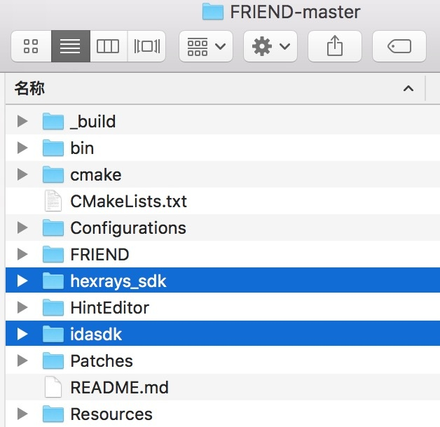
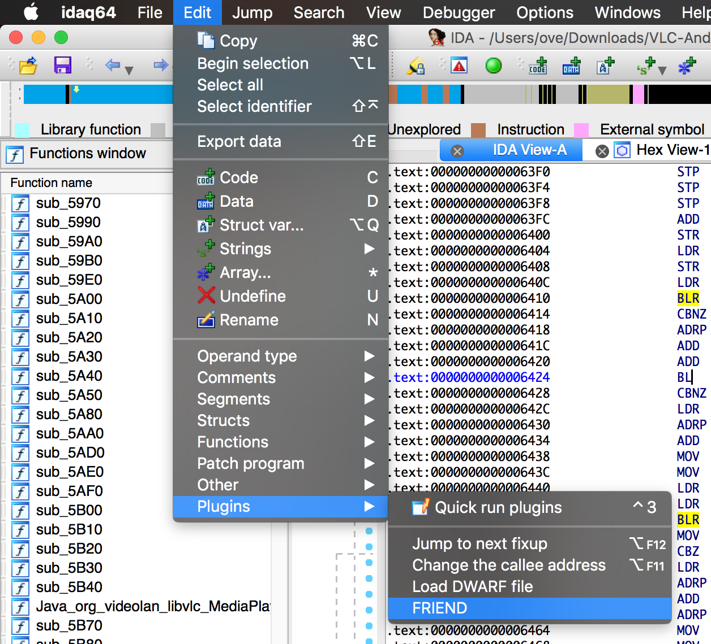
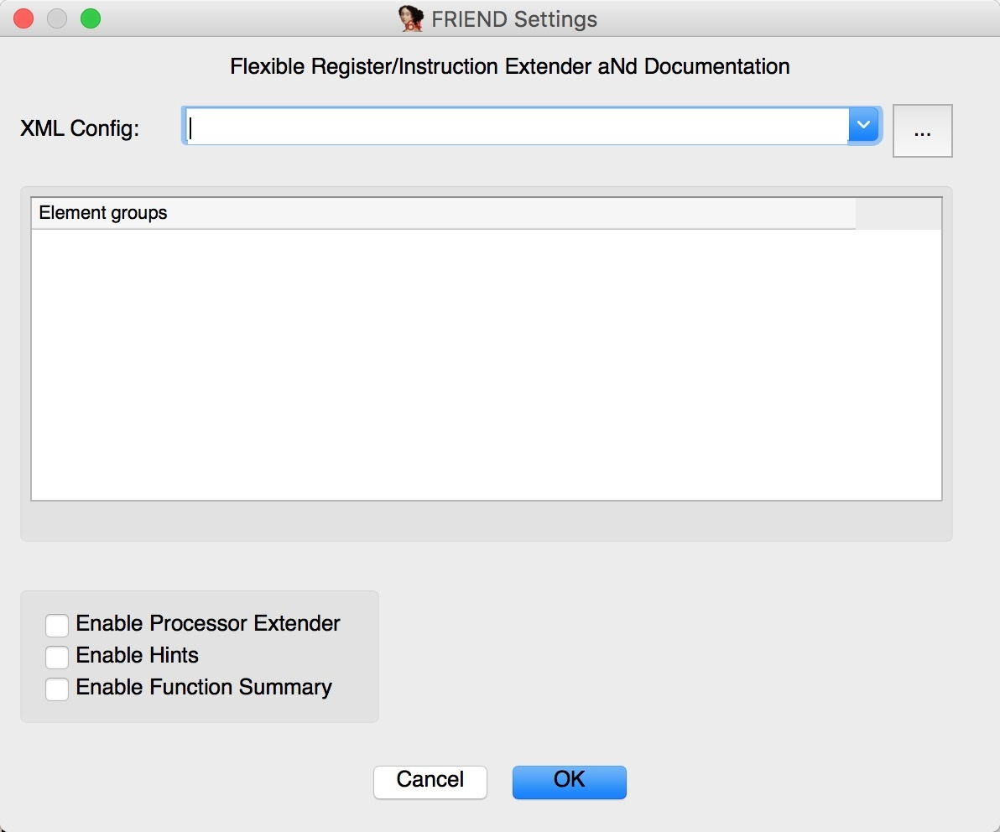
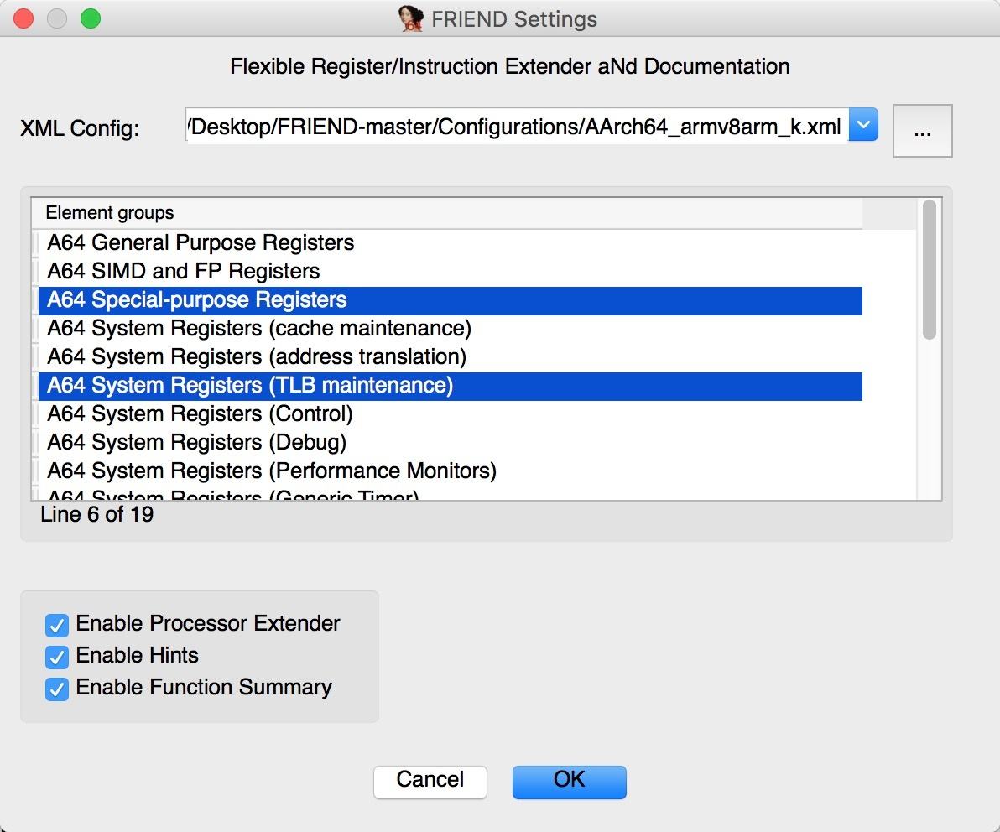
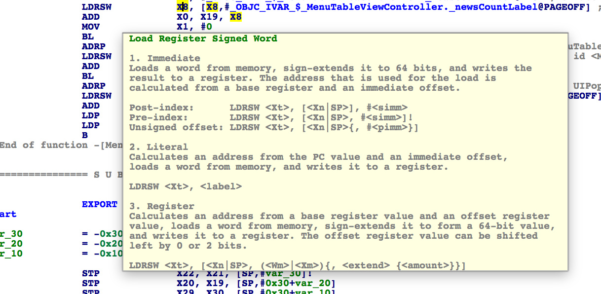
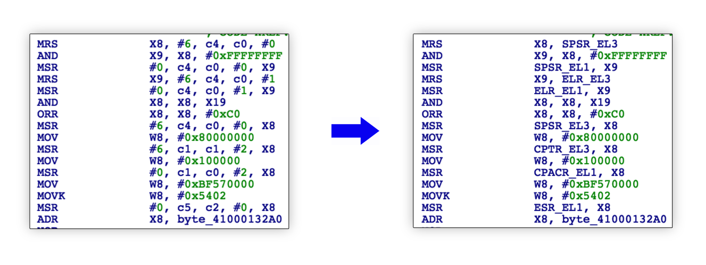
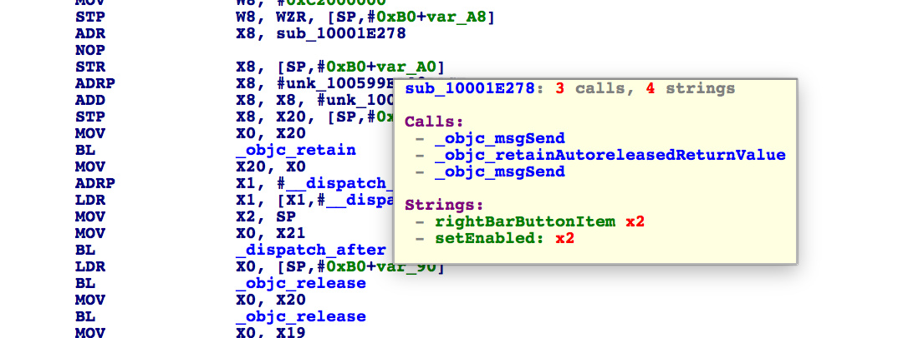
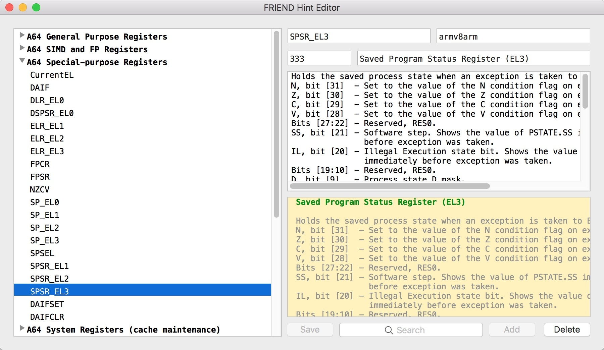
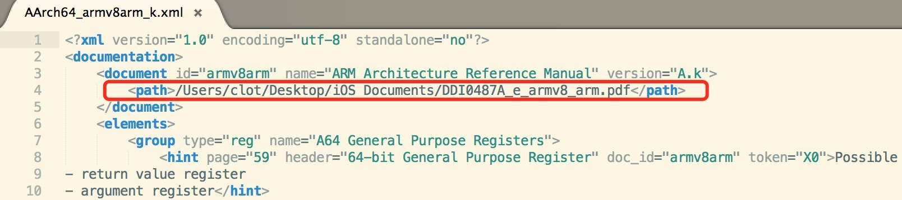
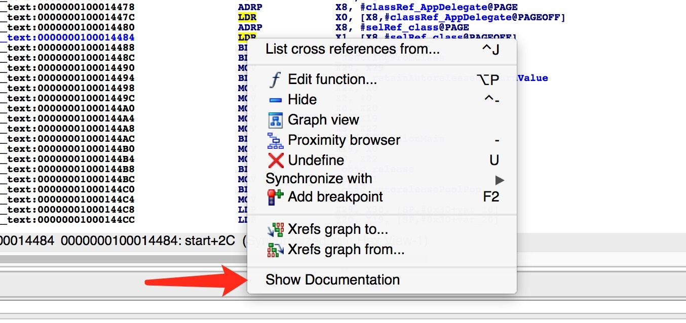

# IDA 插件- FRIEND 的安装和使用

[FRIEND](https://github.com/alexhude/FRIEND)

2017.08 小组实验操作。成员：布兜儿，寒, kiba, mAd mArk, 初见， AloneMonkey

--------

## 一、FRIEND介绍

FRIEND是反汇编软件 [IDA](https://www.hex-rays.com/products/ida/index.shtml) 的一个功能增强插件。它能提高 IDA 反编译结果的可读性，为指令和寄存器提供参考文档。其主要功能如下：

> 1. 利用第三方的库(如：[Capstone](http://www.capstone-engine.org))提高反汇编结果的可读性。
> 2. 显示指令和寄存器对应的信息。
> 3. 在外部的浏览器中打开指令或寄存器对应的参考文档。
> 4. 显示函数的调用总结。
> 5. 开启和关闭不同的指令及寄存器的提示信息。


## 二、环境要求

FRIEND 支持 Windows、Linux 和 macOS。不同的平台，需要的软件稍有不同，如下：

> 1. [CMake](https://cmake.org) 3.3及以上版本。
> 2. 编译器：GCC 或着 Clang(Linux、macOS)、Visual Studio 2015 或更高版本(Windows)。
> 3. [Git](https://git-scm.com)
> 4. IDA SDK
> 5. Hex-Rays SDK( macOS 下的 Hex-Rays SDK 在 IDA 的安装目录下的 Contents/MacOS/plugins/hexrays_sdk 目录中，可选)


注：

> * 本文使用的环境是 macOS、IDA6.8，部分功能失效。
> * CMake如无法直接在终端中使用，则需要手动添加路径
```shell
export PATH=$PATH:/Applications/CMake.app/Contents/bin
```


## 三、编译安装FRIEND

1. 下载 [FRIEND](https://github.com/alexhude/FRIEND)

2. 下载依赖 SDK：**idasdk**、**hexrays_sdk**，并将内容拷贝到相应目录。


3. 定位到 FRIEND 目录下，执行以下命令：
```
$ mkdir _build     
$ cd _build      
$ cmake [-DUn/large/006tNc79gy1fjlimmgvx2j30hkSE_HEXRAYS=OFF] ..
$ make
```

4. 在 `_build` 目录下可以看到相应的二进制文件已经生成。插件生成之后，按照原文的描述，需要复制到 `/Applications/IDA Pro 6.95/idabin/plugins` 这个目录，但实际操作中保存到的目录是 `/Applications/idaq.app/Contents/MacOS/plugins`

再重新打开 IDA，点击 `Edit` --> `Plugins` 就可以看到FRIEND插件了。


## 四、使用 FRIEND

1. 点击 FRIEND，进入插件配置界面：


2. 选择你想要关联的说明文档。在 `/FRIEND-master/Configurations` 目录下有两个XML文件，这里我们选择 `AArch64_armv8arm_k.xml`。导入后，选择自己想要文档化的内容，并勾选下面三个勾，**允许做处理器扩展、允许显示提示、允许显示函数概要**。点击 OK。




配置完成后，来看看效果：

 1. 指令/寄存器的解释，再也不用手动去搜了：


 2. 指令更明了：


 3. 显示函数的概要：
 


## 五、配置编辑工具 HintEditor


FRIEND 还提供了编辑提示文档的功能。使用 `FRIEND` 中提供的工具 `FRIEND Hint Editor` 对 `/FRIEND-master/Configurations/AArch64_armv8arm_k.xml` 进行编辑。

* 这个工具也在 `FRIEND-master/` 目录下，同样也需要手动创建：

```
$ cd HintEditor/HintEditor/
$ mkdir _build      
$ cd _build         
$ cmake -G Xcode ..     
$ xcodebuild    
```

* 创建成功后，在 `HintEditor/HintEditor/Debug/ `目录下生成了HintEditor.app，运行并打开 `AArch64_armv8arm_k.xml` 文件，看到如下界面后，便可进行添加、删除、编辑条目的操作了：


* 记得替换 `AArch64_armv8arm_k.xml` 文件中的文档指定路径，


* 修改后可以右击条目，选择 `Show Documentation`，会调起浏览器访问你所指定的ARM文档，检索你所选中的条目。


***

**以上就是 FRIEND 插件的安装、配置和使用。看到这相信你也一定感受到这款插件所带来的便利了吧。**