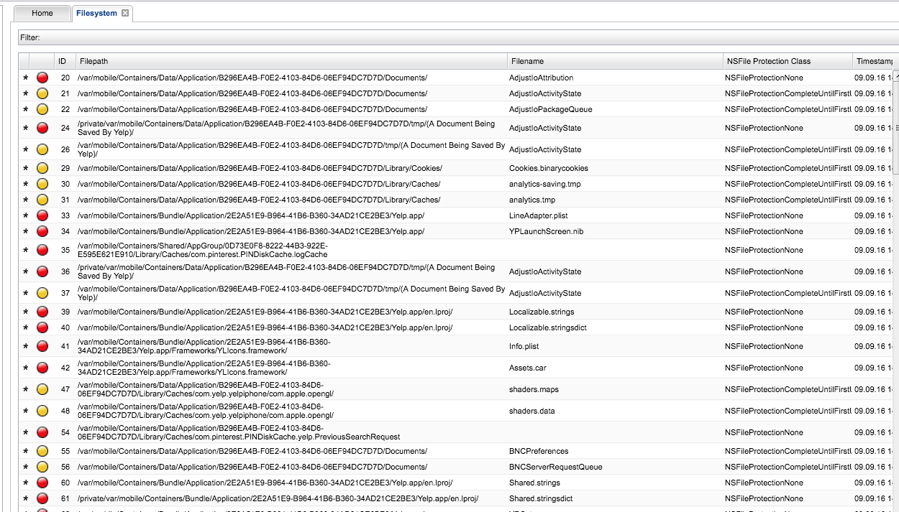
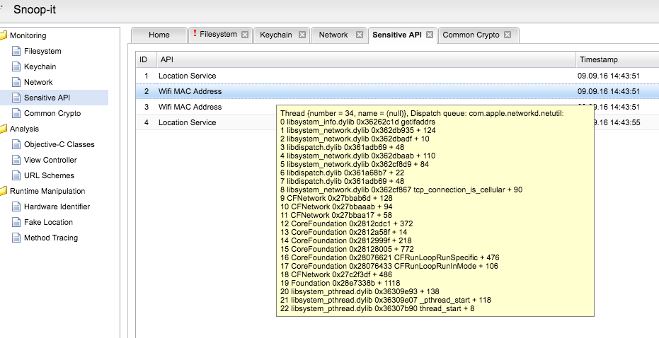

## iOS应用安全评估方法论

######  原文：[iOS Application Security Review Methodology](http://research.aurainfosec.io/ios-application-security-review-methodology/)

下面的文章旨在提供iOS应用安全评估方法的概述并介绍一些用来分析的公开工具。

[TOC]

#### iOS Sandbox

每个应用在iOS设备上都运行在一个沙盒环境中。这意味着一个应用,如果有危害,也无法访问另一个应用程序数据,除非利用iOS本身的漏洞。这种分离是由操作系统维持并基于四个不同的关键组件：

- Entitlements
- Containers
- Powerbox
- XPC Services

#### Entitlements

为了使用附加功能如iCloud，推送通知，或苹果支付，一个应用程序需要指定权限的列表。换句话说,更多的功能被启用来扩展应用程序的沙盒。entitlement是一个配置列表包含在应用程序的签名中。

#### Containers

在iOS，应用程序运行在自己的容器。当应用程序启动时，会为应用程序设置两个环境变量:```HOME```和```CFFIXED_USER_HOME```。通过这种方式，让应用程序的主目录是由iOS决定的一个目录。如果应用尝试访问真实系统用户的主目录，沙盒会拒绝它。

#### Powerbox

如果一个应用程序试图访问自己沙盒外的文件，系统会拒绝访问。iOS提供一个信任的中介程序,称为Powerbox,应用程序可以调用它,来向用户请求访问一个在应用沙盒外的文件。如果一个应用请求这种访问,用户看到一个弹出提示来选择将被允许访问文件。一旦用户选择了某项，那个文件就可以被应用直接访问。

#### XPC Services

为了让开发人员可以对相同的应用程序组件进行权限分离，iOS实现了一个名为```XPC```的进程间通信(IPC)技术。一个XPC服务运行在自己的沙盒中,这意味着不同的XPC服务可以设置不同的权限。一个应用的XPC服务只能被应用本身访问，生命周期是完全由操作系统维持的。

#### Need for Jailbreak

为了进行一次彻底的iOS应用审查，用一个越狱设备是比较明智的。有一系列的测试可以在非越狱设备上执行，但审查在这种情况下是有局限性的。在这篇文章中,可以执行在非越狱设备上的检查会标记<span style="color: green">[Jailbreak unnecessary]</span>，而当越狱是必要的,标签将被指定为 <span style="color: red">[Jailbreak needed]</span>。一些越狱设备的应用程序审查工具，请看： <http://resources.infosecinstitute.com/ios-application-security-part-1-setting-up-a-mobile-pentesting-platform/>

#### Remote API

大部分的移动应用程序依赖于网络API来执行用户身份验证，同步或备份本地应用程序的数据，等等。为了测试这些API，需要一个代理程序去代理移动应用程序的网络请求(例如Burp)。设置设备代理请求到另一个主机,请参考官方代理指南。拿Burp来说，请看： <https://support.portswigger.net/customer/portal/articles/1841108-configuring-an-ios-device-to-work-with-burp>。这篇文章不会关注潜在的远程API问题。一个列表来检查本地移动应用的网络通信:

- 远程API的富文本通信
- 缺乏SSL证书锁定
- SSL错误配置

##### 远程API的富文本通信（Plain Text Communication with Remote API）

<span style="color: green">[Jailbreak unnecessary]</span>首先要检查的是应用的网络通信使用SSL / TLS。如果使用明文HTTP协议，应用程序很容易受到中间人攻击，一个潜在的攻击者能够拦截和修改网络的数据。

##### 缺乏SSL证书锁定（Lack of SSL Certificate Pinning）

锁定是将一个主机与它们预期的SSL证书或公钥关联起来。

<span style="color: green">[Jailbreak unnecessary]</span>iOS设备设置正确的代理代理网络流量后，启动应用程序并尝试生成网络流量，例如通过登录。如果应用程序拒绝连接，证书锁定就被应用程序正确应用了。否则，就可以对移动应用程序流量执行中间人攻击。

<span style="color: red">[Jailbreak needed]</span>如果证书锁定被应用了，尝试使用[SSL Kill Switch](http://research.aurainfosec.io/ios-application-security-review-methodology/)来更好的理解应用程序调用API的端点和参数。

##### SSL错误配置（SSL Misconfiguration）

<span style="color: green">[Jailbreak unnecessary]</span>移动应用程序的开发过程中,开发人员可能为了方便开发过程而接受任何自签名的SSL证书。这个检查可能在应用程序被部署在苹果商店的时候忘记。所以审查应用程序时的一件事是确认它是否接受任何形式的自签名证书。

### 静态分析

这篇文章将使用[Yelp](https://itunes.apple.com/en/app/yelp/id284910350)作为一个例子。它没有漏洞被发现和利用。选择它纯粹是为了描述一个评估iOS应用程序方法。应用程序的静态分析包括审查和逆向应用程序的二进制文件。下面列表是一些用来执行审查的工具。

##### Needle

<span style="color: red">[Jailbreak needed]</span>Needle是[MWR Infosecurity](https://www.mwrinfosecurity.com/)在2016年8月发布的工具，旨在通过在设备和电脑上安装一系列工具来进行分析促进审查iOS应用程序。当前的特性,在2016年10月,允许进行应用程序二进制、存储、动态和静态(如果有源代码)分析。它还可以用Cycript和Frida进行hook。Needle是用Python编写的,可以很容易地在shell下使用:

```
python needle.py
```

Needle有一些配置来连接到iOS设备(需要OpenSSH服务器在设备上运行)。在接下来的例子中,iOS设备IP `192.168.2.3`，我们连接到默认的SSH端口`22` ，为了提取一些基本信息使用`metadata`模块

```
set IP 192.168.2.3
set PORT 22
use metadata
run
```

结果已部分截断，显示设备上的应用程序的文件路径，所支持cpu架构,最低iOS版本,等等。

```
/private/var/mobile/Containers/Bundle/Application/2E2A51E9-B964-41B6-B360-34AD21CE2BE3/Yelp.app/Yelp
Architectures       : armv7, arm64
Platform Version    : 9.3
SDK Version         : iphoneos9.3
Minimum OS          : 8.0
```

一个模块有应用程序的编译标记`binary/compilation_checks`。在这种情况下需要检查二进制保护是否缺失，如堆栈金丝雀保护( stack canaries)，PIE，和自动引用计数([ARC](https://en.wikipedia.org/wiki/Automatic_Reference_Counting))。

##### Application Encryption

<span style="color: red">[Jailbreak needed]</span>在苹果商店的应用都有苹果的二进制加密。

Needle可以解密IPA。这篇文章不会太关注Needle在这方面的使用。

[Dumpdecrypted](https://github.com/stefanesser/dumpdecrypted)是来解密iOS应用二进制文件很好的一个工具。它可以用在以下方式:

```
DYLD_INSERT_LIBRARIES=/usr/lib/dumpdecrypted.dylib /private/var/mobile/Containers/Bundle/Application/2E2A51E9-B964-41B6-B360-34AD21CE2BE3/Yelp.app/Yelp
```

Yelp.decrypted将被创建。为了检查二进制支持的架构，可以使用`lipo`:

```
lipo -info Yelp.decrypted
```

前面命令的结果是:

```
Architectures in the fat file: /private/var/mobile/Containers/Bundle/Application/2E2A51E9-B964-41B6-B360-34AD21CE2BE3/Yelp.app/Yelp are: armv7 arm64
```

相似的工具是苹果的`otool`:

```
otool -vh Yelp.decrypted
```

上一条命令的结果:

```
Mach header
      magic cputype cpusubtype  caps    filetype ncmds sizeofcmds      flags
   MH_MAGIC     ARM         V7  0x00     EXECUTE   116       9800   NOUNDEFS DYLDLINK TWOLEVEL WEAK_DEFINES BINDS_TO_WEAK PIE
/private/var/mobile/Containers/Bundle/Application/2E2A51E9-B964-41B6-B360-34AD21CE2BE3/Yelp.app/Yelp (architecture arm64):
Mach header
      magic cputype cpusubtype  caps    filetype ncmds sizeofcmds      flags
MH_MAGIC_64   ARM64        ALL  0x00     EXECUTE   116      10584   NOUNDEFS DYLDLINK TWOLEVEL WEAK_DEFINES BINDS_TO_WEAK PIE
```

`lipo`也可以用来提取可执行文件的指定体系结构。在这个例子中,将使用`armv7`:

```
lipo -thin armv7 -output Yelpv7 Yelp.decrypted
```

现在让我们确认下新的可执行文件只有支持1个架构:

```
otool -vh Yelpv7
```

```
Yelpv7:
Mach header
      magic cputype cpusubtype  caps    filetype ncmds sizeofcmds      flags
   MH_MAGIC     ARM         V7  0x00     EXECUTE   116       9800   NOUNDEFS DYLDLINK TWOLEVEL WEAK_DEFINES BINDS_TO_WEAK PIE
```

上传这个文件到电脑：

```scp root@192.168.2.3:/private/var/root/Yelpv7 .```

解密过程可以手动实现，通过启动应用程序，附加gdb到进程然后dump内存未加密程序到文件。如果用解密工具失败了，这是个值得考虑的方法。手动解密过程不包含在这篇文章中。

现在有了未加密的可执行文件，就可以用Hopper、IDA或其他反编译工具去分析它。

下面，Hopper分析后的几张截图:


##### Check for Plist Files

<span style="color: green">[Jailbreak unnecessary]</span>应用程序可能使用`plist`文件来存储配置信息。Plist是一个XML结构的属性列表文本文件。当评估一个iOS应用程序,其中一个检查是存储在plist文件的硬编码凭证。访问这些文件不需要越狱设备。 [i-funbox](http://www.i-funbox.com/)是一个工具,可以导出iOS设备上应用沙盒中的数据,包括plist文件。

##### Check for Keychain Data and SQLite DBs

<span style="color: red">[Jailbreak needed]</span>钥匙链是iOS提供的一个允许应用程序存储敏感数据服务，如凭证或API访问令牌。钥匙链会在数据存储在文件系统之前加密。越狱的设备可以完全访问存储在钥匙链的数据。 [Keychain-Dumper](https://github.com/ptoomey3/Keychain-Dumper) 是在越狱设备上导出所有钥匙链数据的工具。当评估一个应用程序，试着查看下它在钥匙链存储的数据。值得称赞的是，数据被一个操作系统提供的额外加密方法加密存储在密钥链中。即使加密密钥可以通过逆向应用得到，也会推迟阻拦一些没经验的攻击者。

<span style="color: green">[Jailbreak unnecessary]</span>在iOS，可以在SQLite数据库中存储数据。sqlite文件可在应用程序沙盒数据目录中。默认情况下，SQLite数据库不加密。[SQLcipher](https://www.zetetic.net/sqlcipher/)是一个可以加密的好选择。当评估一个应用程序时，一定要检查在SQLite数据库中是否保存任何数据和什么样的数据，看看是否启用加密。

##### Check for HTTP Caching Responses

<span style="color: green">[Jailbreak unnecessary]</span>如果应用程序使用了内置`NSURLRequest`执行HTTP请求，响应可能会被缓存在与应用相关的`Cache.db` SQLite文件。远程API / Web服务器的响应不包含`Cache - Control`头字段，敏感信息可能会被存储在设备上。注意，缓存数据存储在这个文件是不加密的。

##### MobFS

<span style="color: red">[Jailbreak needed]</span>[MobFS](https://github.com/ajinabraham/Mobile-Security-Framework-MobSF)是一个进行静态/动态分析iOS和Android应用程序的开源工具。在这篇文章中不会涉及这个工具，但审查时还是值得试一下。注意，越狱是在没有IPA需要从设备提取时才需要。

### 动态分析

动态分析是在运行时对应用的过程进行操纵，为了试图实现如下目的:

- 绕过越狱检测
- 窃取加密密钥或敏感数据
- 绕过某些控制加载ViewControllers
- 攻击本地身份验证(如果存在)
- 当接触企业应用时转向内部网络
- 检查自定义加密算法

##### Instrumentation

<span style="color: red">[Jailbreak needed]</span>有一些工具来执行所谓的`instrumentation` ，在运行时探索和修改应用过程的流程。比较有名的有：

- Cycript

- Frida

- Cydia substrate

- GDB

- 动态链接器来覆盖函数(`LD_PRELOAD`)

##### Cycript

<span style="color: red">[Jailbreak needed]</span> [Cycript](http://www.cycript.org/)是一个很棒的工具来探索和修改在iOS上运行的应用程序。它使用一个混合的语法，objective - c和JavaScript语法。它可以通过应用程序的进程名称或PID开始:

```cycript -p Yelp```

一旦附加到进程，就可以探索应用程序组件:

```
cy# UIApp
#"<UIApplication: 0x1667a760>"
cy# [UIApplication sharedApplication]
#"<UIApplication: 0x1667a760>"
cy# UIApp.keyWindow
#"<UIWindow: 0x17bdfd70; frame = (0 0; 768 1024); gestureRecognizers = <NSArray: 0x17f14270>; layer = <UIWindowLayer: 0x17d23150>>"
cy# UIApp.keyWindow.rootViewController
#"<YPUITabBarViewController_iPad: 0x17c30b90>"
cy# UIApp.delegate
#"<YPUIApplicationDelegate_iPad: 0x1667fd30>"
```

可以手动调用方法，改变当前的`ViewController`等等。

在以下示例中,我们假装`YPUIApplicationDelegate_iPad`类实现一个方法称为`correctCredentials`验证用户输入凭据，如果凭证是正确的，返回`true`。Cycript允许在运行时重新定义方法。在这种情况下,当调用此方法时我们要始终返回`true`:

```
cy# YPUIApplicationDelegate_iPad.prototype['correctCredentials'] = function(){return true;}
function () {return!0;}
```

相同的方法可以用到应用的越狱保护手段。

当评估一个应用程序,检查什么样的绕过手法可以通过操纵运行时过程完成。如果绕过某些函数可以很容易地实现破解，这可能是应用程序本身的设计问题。

##### Snoop-it

<span style="color: red">[Jailbreak needed]</span>[Snoop-it](https://code.google.com/archive/p/snoop-it/)是另一个很棒的工具来执行iOS应用程序的动态分析。我个人觉得它有点不稳定，Snoop-it附加应用时经常会导致应用崩溃。但除此之外，它提供了一个用户友好的web界面和极好的功能，下面描述。

###### Snoop-it Filesystem Module

这个模块监控应用程序的文件访问:



###### Snoop-it Crypto Module

这个模块跟踪常见的加密API调用:


###### Snoop-it Fake Location Module

这个模块允许应用程序请求当前设备GPS坐标时提供一个假的位置:


###### Snoop-it Hardware Spoof Module

这个模块允许重写设备的UDID和mac地址:


###### Snoop-it Keychain Module

这个模块跟踪访问或存储在钥匙链的数据:


###### Snoop-it Method Invoke Module

这个模块允许在运行时调用方法，和之前描述Cycript的方法相似:


###### Snoop-it Method Tracing Module

这个模块跟踪应用程序执行过程中调用的方法:


###### Snoop-it Network Module

这个模块跟踪应用程序的HTTP和HTTPS请求:


###### Snoop-it Sensitive API Module

这个模块跟踪敏感的API调用，比如当前设备位置，无线网络接口的Mac地址，等等:



###### Snoop-it URL Schemes Module

URL schemes是与其他应用通信的一种方法。该模块显示URL schemes在应用程序中实现:


##### IDB

<span style="color: red">[Jailbreak needed]</span> [IDB](http://www.idbtool.com/)是另一个开源工具，用Ruby编写，和Snoop-it以类似的方式工作。它不允许像Snoop-it那样动态调用方法，但它有其他的功能，如检查系统日志和粘贴板，和测试URL schemes。

###### IDB App Info


###### IDB Keychain


###### IDB Log


###### IDB Pasteboard


###### IDB Shared Libraries


###### IDB Storage


###### IDB URL Handlers


##### introspy-ios / introspy-analyzer

<span style="color: red">[Jailbreak needed]</span>  [Introspy-iOS](https://github.com/iSECPartners/Introspy-iOS) 帮助自动化应用的运行时分析和识别潜在的安全问题。Introspy-iOS(`tracer`)hook和检查应用的敏感API调用。它将结果存储在设备上的本地SQLite数据库中。 [Introspy-Analyzer](https://github.com/iSECPartners/Introspy-Analyzer)是一个工具，帮助格式化tracer的数据并生成HTML报告。下面的例子是这个工具hook Yelp应用的结果。


##### Snapshot（快照）

<span style="color: green">[Jailbreak unnecessary]</span>当应用进入后台，按设备`home`按钮，iOS将对当前应用的屏幕截图。截图保存到下一次设备重启。当评估一个应用程序，检查是否显示任何敏感信息;如果是的，当信息显示时让应用进入后台然后检查iOS的屏幕截图。如果是越狱设备，Needle，先前在这篇文章中提到的工具，提供了一种简便的方法来执行这个测试并自动下载截图给你。否则,手动定位文件在应用沙盒目录中位置，使用i-funbox导出。

##### Jailbreak Detection（越狱检测）

<span style="color: red">[Jailbreak needed]</span>作为深入的安全措施，应用程序可能会执行越狱设备检测并拒绝在越狱设备上运行。如果敏感数据存储在设备上，应用程序一旦检测到越狱可能会删除这些数据。当评估一个应用程序，检查越狱检测是否执行以及其有效程度。

##### Anti-Debugging Protection(反调试保护)

<span style="color: red">[Jailbreak needed]</span>作为深入的另一个安全措施，应用程序可能会发现它在调试模式下运行，被调试器连接，如GDB，然后停止运行。即使有经验的人能够绕过这样的保护，缺乏经验的人可能会被阻拦而转向下一个目标。

##### Keyboard Cache(键盘缓存)

<span style="color: red">[Jailbreak needed]</span>当在iOS应用内部的输入框输入文本时，数据为了自动校正会被缓存，除了密码类输入框和一些其它特定的字符串。当评估一个应用时，检查哪些数据被存储在缓存中。

##### Buffer Overflow / Format Strings / Memory Corruption(缓冲区溢出/格式字符串/内存崩溃)

<span style="color: green">[Jailbreak unnecessary]</span>iOS应用程序易受到内存崩溃漏洞的攻击，如缓冲区溢出和格式字符串。在进行审查时，值得试着模糊测试用户输入，检查应用程序如果崩溃，这可能表明应用程序是脆弱的。如果测试越狱设备，可以用调试器进一步分析崩溃。

### 参考

- Apple Sandbox: <https://developer.apple.com/library/content/documentation/Security/Conceptual/AppSandboxDesignGuide/AppSandboxInDepth/AppSandboxInDepth.html>，
  <https://developer.apple.com/videos/play/wwdc2013/710/>，
  <http://devstreaming.apple.com/videos/wwdc/2013/710xfx3xn8197k4i9s2rvyb/710/710.pdf>

- Apple Entitlements: <https://developer.apple.com/library/content/documentation/IDEs/Conceptual/AppDistributionGuide/AddingCapabilities/AddingCapabilities.html>

- Apple plist files: <https://developer.apple.com/library/content/documentation/General/Reference/InfoPlistKeyReference/Articles/AboutInformationPropertyListFiles.html>

- Apple keychain: <https://developer.apple.com/library/content/documentation/Security/Conceptual/keychainServConcepts/02concepts/concepts.html>

- Apple Inter-App Communication: <https://developer.apple.com/library/content/documentation/iPhone/Conceptual/iPhoneOSProgrammingGuide/Inter-AppCommunication/Inter-AppCommunication.html>

- Certificate Pinning: <https://www.owasp.org/index.php/Certificate_and_Public_Key_Pinning>

- SSL Kill Switch: <https://github.com/nabla-c0d3/ssl-kill-switch2>

- i-funbox: <http://www.i-funbox.com/>

- Needle: <https://github.com/mwrlabs/needle>

- MobFS: <https://github.com/ajinabraham/Mobile-Security-Framework-MobSF>

- SQLcipher: <https://www.zetetic.net/sqlcipher/>

- Dumpdecrypted: <https://github.com/stefanesser/dumpdecrypted>

- idbtool: <https://github.com/dmayer/idb>

- Cycript: <http://www.cycript.org/>

- GDB: <https://www.gnu.org/software/gdb/>

- Cydia substrate: <http://www.cydiasubstrate.com/>

- Frida: <http://www.frida.re/>

- Introspy-iOS: <https://github.com/iSECPartners/Introspy-iOS>

- Instrospy-Analyzer: <https://github.com/iSECPartners/Introspy-Analyzer>

- Snoop-it: <https://code.google.com/p/snoop-it/>

- OWASP iOS Application Security Testing: <https://www.owasp.org/index.php/IOS_Application_Security_Testing_Cheat_Sheet>
